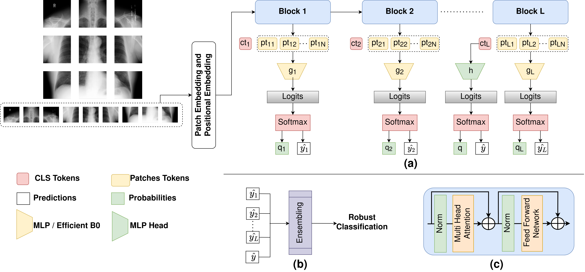

# Group G06
Thao Do Chi Nguyen, Junchen Liu, Xiwei Liu

This repository includes the source code for for team G006's AI701 project : "Enhanced Vision Transformer for Robustness against adversarial attacks on Medical Image Classification"



## Abstract 
Vision Transformers (ViTs) have become powerful tools in the field of medicine. At the same time, doubts about medical ViTs and their vulnerability to adversarial attacks have raised the public's concern. Moreover, the significant performance degradation inspired us we need to improve the robustness of ViTs. In our project, we introduce Self-Ensembling Vision Transformer with EfficientB0 network (SEViT_B0) and prove its superior performance on adversarial attacks. We evaluated our model on three datasets and achieve state of art results on recent attack methods benchmark, demonstrating the outstanding performance of our model.

## Download Dataset (Chest X-ray)
[Chest X-ray dataset](https://www.kaggle.com/datasets/tawsifurrahman/tuberculosis-tb-chest-xray-dataset).
[1] includes 7000 images (3500 Normal images and 3500 Tuberculosis images). Download the splitted data from [here](https://drive.google.com/drive/folders/1XmdB37YowEHQTak2rU2iqyzHK8WBF7pO?usp=sharing). 

[APTOS2019 dataset](https://www.kaggle.com/c/aptos2019-blindness-detection/data),[2] which we mention as Fundoscopy in this project. The dataset encompasses 3,662 retina images which are specifically curated to facilitate the diagnosis of diabetic retinopathy (DR). From the original dataset with 5 classes, we have converted this dataset into a binary classification task by labeling the images as DR or Normal

[Malaria Cells dataset](https://www.kaggle.com/datasets/iarunava/cell-images-for-detecting-malaria),[3] which we mention as Fundoscopy in this project. The dataset encompasses 3,662 retina images which are specifically curated to facilitate the diagnosis of diabetic retinopathy (DR). From the original dataset with 5 classes, we have converted this dataset into a binary classification task by labeling the images as DR or Normal

**Move the donwloaded dataset to corresponding folder in `data` directory**

For example: 

* Chest X-ray dataset should be move to "SEViT/data/X-ray"

* Fundoscopy dataset should be move to "SEViT/data/Fundoscopy"

* Malaria dataset should be move to "SEViT/data/Malaria"

**Move the downloaded folder to `data` directory**

## Download ViT and Intermediate MLPs
Download the finetuned ViT from [here]() and trained MLPs from [here](). 

**Move the donwloaded files to corresponding folder in `models` directory**

For example: 

Finetuned ViT on X-ray dataset should be move to "SEViT/models/X-ray"

Trained MLPs on X-ray dataset should be move to "SEViT/models/X-ray/MLP"

Trained EfficientnetB0 on X-ray dataset should be move to "SEViT/models/X-ray/B0"

## Install dependencies
You should implement this project on python 3.8.

Run the following command to install dependencies: 

```
pip install -r requirements.txt
```

Also you need to install autoattack library:

```
pip install git+https://github.com/fra31/auto-attack
```
## Test vanilla ViT 
To test the performance of the ViT on the test samples, run the following commmand: 

```
python mytest.py --vit_dir [path of the downloaded ViT model]  --root_dir [path of clean testing dataset]

````

**As for MBZUAI students, you can use this line:**  python mytest.py --vit_dir /l/users/thao.nguyen/SEViT_MBZUAI/models/X-ray/m_best_model.pth  --root_dir /l/users/thao.nguyen/SEViT_MBZUAI/data/X-ray/

## Generate Adversarial Attacks from Test Samples
To generate attacks from clean samples and ViT as a target model, run the the following command: 

```
python generate_attacks.py --epsilons [perturbation size:float] --attack_list [attack #1] [attack #2] --vit_path [path to the downloaded ViT model]  
--attack_images_dir [path to create folder and save attack samples]
```

## Adversarial Robustness (Majority Voting)
In order to evaluate **SEViT** on **Clean samples:** 

```
python majority-voting.py python majority_voting_thao.py --vit_dir [path of the downloaded ViT model] --root_dir [path of the downloaded clean testing dataset] --mlp_dir [path of the trained mlp or EfficientnetB0]--images_type [clean or adversarial] --clf_type MLP [b0 or MLP]
```

**As for MBZUAI students, you can use this line:** python majority_voting_thao.py --vit_dir /l/users/thao.nguyen/SEViT_MBZUAI/models/X-ray/m_best_model.pth --root_dir /l/users/thao.nguyen/SEViT_MBZUAI/data/X-ray/ --mlp_dir /l/users/thao.nguyen/SEViT_MBZUAI/models/X-ray/MLP/ --images_type clean --clf_type MLP

To evaluate **SEViT** performance on **Attack samples:**

```
python majority_voting_thao.py --vit_dir [path of the downloaded ViT model] --root_dir [path of the downloaded clean attacked dataset] --mlp_dir [path of the trained mlp or EfficientnetB0] --attack_list ["CW" "PGD" "L2PGD" ...] --images_type [clean or adversarial] --clf_type [b0 or MLP]
```

**As for MBZUAI students, you can use this line:**  python majority_voting_thao.py --vit_dir /l/users/thao.nguyen/SEViT_MBZUAI/models/X-ray/m_best_model.pth --root_dir /l/users/thao.nguyen/SEViT_MBZUAI/attack/X-ray/epsilon0.01/attack_test/ --mlp_dir /l/users/thao.nguyen/SEViT_MBZUAI/models/X-ray/MLP/ --attack_list "CW" "PGD" --images_type adversarial --clf_type MLP

## Contact
If you have any questions, please create an issue on this repository or contact at thao.nguyen@mbzuai.ac.ae.

# References
1. Tawsifur Rahman, Amith Khandakar, Muhammad A. Kadir, Khandaker R. Islam, Khandaker F. Islam, Zaid B. Mahbub, Mohamed Arselene Ayari, Muhammad E. H. Chowdhury. (2020) "Reliable Tuberculosis Detection using Chest X-ray with Deep Learning, Segmentation and Visualization". IEEE Access, Vol. 8, pp 191586 - 191601. DOI. 10.1109/ACCESS.2020.3031384.

2. Faris Almalik, Mohammad Yaqub, and Karthik Nandakumar. Self-ensembling vision trans-280 former (sevit) for robust medical image classification. In International Conference on Medical281 Image Computing and Computer-Assisted Intervention, pages 376–386. Springer, 2022.
